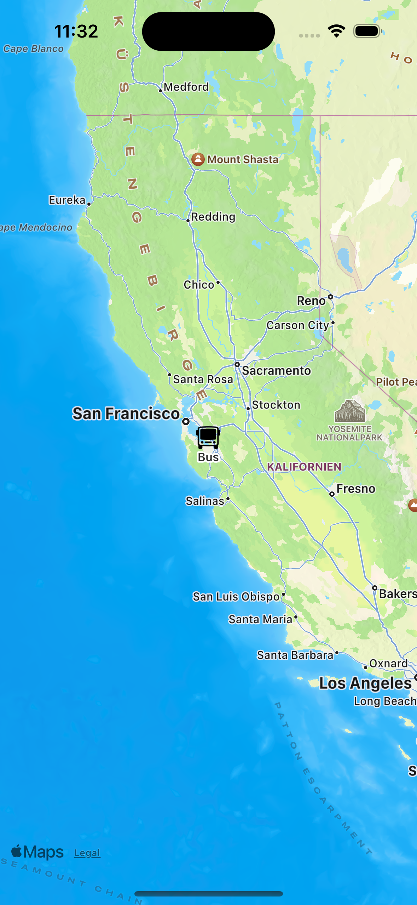
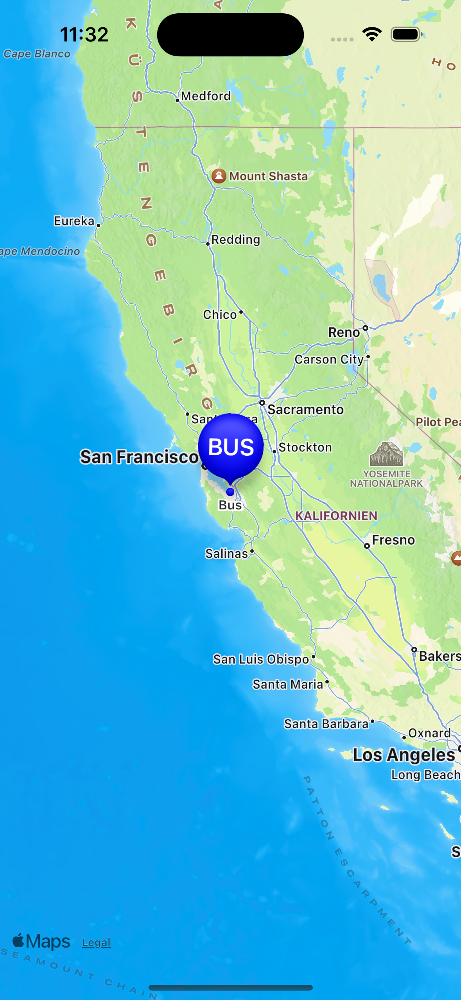
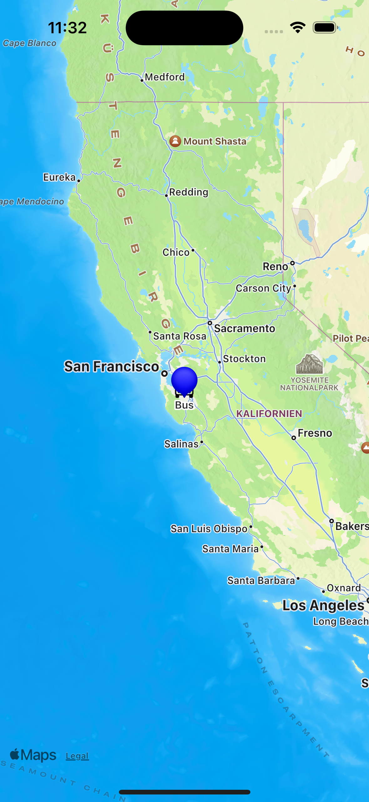

# iOS17_MarkerTintColorBug
Sample project demonstrating the issue of a MKMarkerAnnotationView ignoring `markerTintColor = .clear`, when it was set to a different color previously. This issue happens on iOS 16 and iOS 17 Seed 1, so far.

# FIXED!! :partying_face: 

Since iOS17 Beta 4 (Xcode 15.0.0 Beta 5) it seems to be fixed! Filing a feedback worked, apparently.
I hope it stays fixed, so only iOS 16 needs a workaround.

## Issue

| Correct :white_check_mark: | Correct :white_check_mark: | Incorrect :x:  |
|:----------|:----------|:----------|
| Unselected state | Selected state | Unselected state again |
|     |  |  |
| The image of the annotation is visible. The marker is transparent, due to `.markerTintColor = .clear`. | The image of the annotation is removed and a big blue marker is visible, since it is selected. | The image of the annotation should be visible, but is hidden behind a small blue empty marker, which should be transparent with `.markerTintColor = .clear`, but isn't. |


Up until iOS 16, it was possible to have an opaque MKMarkerAnnotationView with a markerTintColor set to a color, transition to a completely transparent marker with markerTintColor = .clear.

This was necessary if you want to only show a `markerAnnotationView.image` on the map (no bubble) when unselected, but the marker bubble with a glyph when the annotation was selected.

However, since iOS 16 and also in iOS 17 Seed 1, this is not possible anymore.

The marker will not be transparent and overlay on top of the `markerAnnotationView.image`.

## Example
Example code of MKMarkerAnnotationView subclass:
``` Swift
class MarkerView: MKMarkerAnnotationView {

    override init(annotation: MKAnnotation?, reuseIdentifier: String?) {
        super.init(annotation: annotation, reuseIdentifier: reuseIdentifier)
        update()
    }
    
    required init?(coder aDecoder: NSCoder) {
        super.init(coder: aDecoder)
        update()
    }
    
    override func setSelected(_ selected: Bool, animated: Bool) {
        super.setSelected(selected, animated: animated)
        update()
    }
    
    func update() {
        if isSelected {
            self.image = nil
            self.glyphText = "BUS"
            self.markerTintColor = .blue
        }else{
            self.image = UIImage(systemName: "bus")
            self.glyphText = ""
            self.markerTintColor = .clear	// <- Issue here, when not .clear before
        }
    }
}
```
`self.markerTintColor = .clear` works the first time, but not a second time, leaving an empty marker on the map, hiding the `.image` below it.

## Test

- Simply open the project in Xcode (15 beta 15A5160n for iOS17 tests) and run on a Simulator or Device. You can also use a previous version of Xcode for testing with iOS 16, which has the same issue.
- Select the annotation with a bus image on the map 
	- a Marker with the Glyph "BUS" will appear
- Tap somewhere on the map to deselect the annotation, 
	- the Marker will shrink, but not disappear, leaving an empty small marker on the map, overlayed on top of the bus image, basically hiding it

## Fix / Workaround

As far as I know, there is no fix, if you want to switch between opaque and transparent markers back and forth.
A workaround would be to not dequeue annotations and always init a new one, which is likely very terrible for memory usage.

### Update
This issue has been fixed since iOS 17 Beta 4 (Xcode 15.0.0 Beta 5)!
